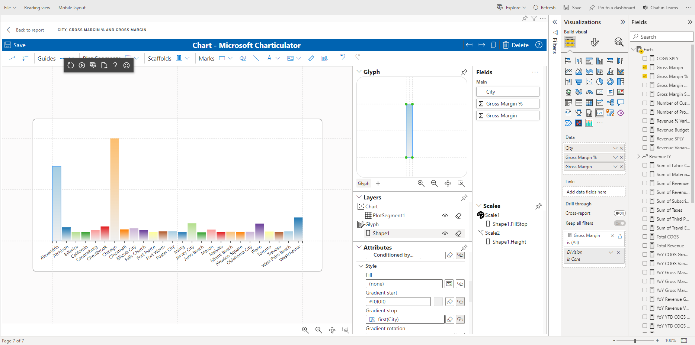

Deployed `beta` branch of Charticulator App is available on [https://zbritva.github.io/charticulator/](https://zbritva.github.io/charticulator/)

# Open source version of Charticulator visual

The source doesn't contains code from original visual. But it includes new version of Charticulator with new features and fixes.

The visual under development and some features is not developed yet.

## Roadmap for public *.pbiviz

* ~~Mapping columns~~
* ~~Supporting Power BI color palette~~
* ~~Support selections~~
* ~~Import template file~~
* ~~Export template to file~~
* Update scales and axes

## Build $ run

`yarn run start:view` - start dev server for viewer container, without editor

`yarn run start:editor` - start dev server for editor 
 
